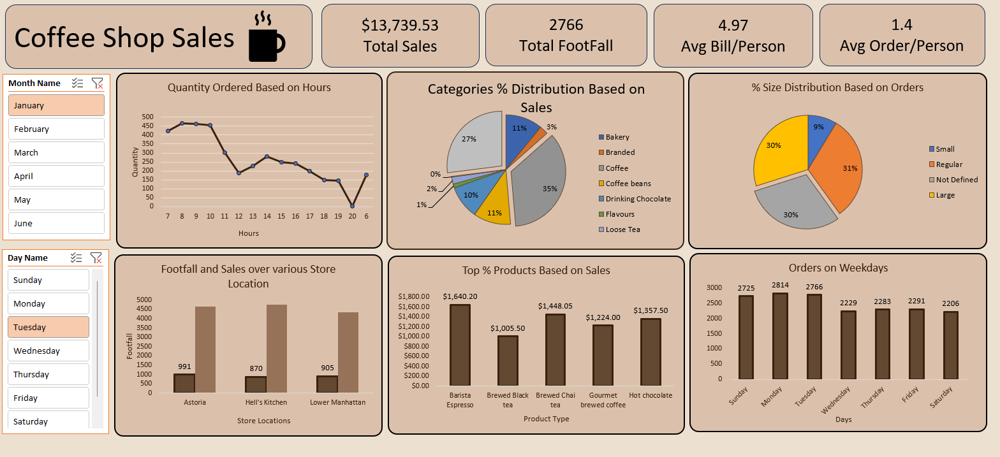

# ☕ Coffee Shop Sales Analysis Dashboard

An end-to-end **Excel-based sales analysis and dashboard project** for a multi-location coffee shop chain, covering 6 months of transactional data (January–June 2023) across three New York City store locations.

---

## 📊 Project Overview

This project analyses over **149,000 real sales transactions** to uncover revenue trends, peak hours, top-selling products, and store-level performance. The final output is an interactive **Excel Dashboard** built using Pivot Tables, Pivot Charts, and Slicers.

---

## 📸 Dashboard Preview



---

## 🗂️ Files

| File | Description |
|------|-------------|
| `Coffee_Shop_Sales.xlsx` | Raw transactional dataset with 149,116 rows and 11 columns |
| `Coffee_Shop_Dashboard_Project.xlsx` | Enriched dataset with derived columns, Pivot Tables, and interactive Dashboard |

---

## 🗃️ Dataset Details

### Raw Data — `Coffee_Shop_Sales.xlsx`

| Column | Description |
|--------|-------------|
| `transaction_id` | Unique ID for each transaction |
| `transaction_date` | Date of the transaction (Jan 1 – Jun 30, 2023) |
| `transaction_time` | Time of the transaction |
| `transaction_qty` | Number of items purchased |
| `store_id` | Numeric store identifier |
| `store_location` | Store name (Lower Manhattan, Hell's Kitchen, Astoria) |
| `product_id` | Unique product identifier |
| `unit_price` | Price per unit |
| `product_category` | Product category (Coffee, Tea, Bakery, etc.) |
| `product_type` | Sub-type of the product |
| `product_detail` | Specific product name and size |

**Time Period:** Jan 2023 – Jun 2023  
**Total Records:** 149,116 transactions  
**Total Revenue:** ~$698,812

---

## 🏪 Store Locations

- 📍 Lower Manhattan
- 📍 Hell's Kitchen
- 📍 Astoria

---

## 🛍️ Product Categories

- Coffee
- Tea
- Drinking Chocolate
- Bakery
- Flavours
- Loose Tea
- Coffee Beans
- Packaged Chocolate
- Branded

---

## 🔧 Data Enrichment (Dashboard File)

The `Coffee_Shop_Dashboard_Project.xlsx` extends the raw data with the following derived columns:

| Column | Description |
|--------|-------------|
| `Size` | Product size (Small, Regular, Large) |
| `Total_bill` | Revenue per transaction (`unit_price × transaction_qty`) |
| `Month Name` | Full month name |
| `Day Name` | Day of the week |
| `Hour` | Hour extracted from transaction time |
| `Day of Week` | Numeric day index (0 = Sunday) |
| `Month` | Month number |

---

## 📈 Dashboard Features

The Excel Dashboard (in `Coffee_Shop_Dashboard_Project.xlsx`) includes:

- **Revenue by Month** — Monthly revenue trend across all locations
- **Revenue by Store Location** — Side-by-side store comparison
- **Transactions by Hour** — Peak business hours analysis
- **Sales by Product Category** — Best-performing product lines
- **Pivot Tables** — Drill-down analysis by location, month, day, and hour
- **Interactive Slicers** — Filter by store, month, and day of week

---

## 🚀 Getting Started

### Prerequisites
- Microsoft Excel 2016 or later (recommended for full Slicer and PivotChart support)
- Alternatively: LibreOffice Calc (some features may vary)

### Steps
1. Clone or download this repository
2. Open `Coffee_Shop_Sales.xlsx` to explore the raw data
3. Open `Coffee_Shop_Dashboard_Project.xlsx` to interact with the Dashboard
4. Use the **Slicers** on the Dashboard sheet to filter by store, month, or day

---

## 💡 Key Insights

- Over **149K transactions** recorded across 6 months
- **3 store locations** across New York City
- **9 product categories** with Coffee and Tea being the primary revenue drivers
- Business hours span **7 AM to 8 PM**, with morning peaks driving the most transactions
- Total revenue across all stores: **~$698,812**

---

## 🛠️ Tools Used

- **Microsoft Excel** — Data cleaning, enrichment, Pivot Tables, Pivot Charts, Slicers, Dashboard design
- **Excel Formulas** — DATE, TEXT, HOUR, WEEKDAY, IF, and more for feature engineering

---

## 📁 Project Structure

```
coffee-shop-main/
│
├── Coffee_Shop_Sales.xlsx             # Raw transaction data
├── Coffee_Shop_Dashboard_Project.xlsx # Enriched data + Pivot Tables + Dashboard
└── README.md                          # Project documentation
```

---

## 🙋 Author

**Esha Mali**  
[GitHub Profile](https://github.com/Esha-Mali)

---

## 📄 License

This project is open source and available under the [MIT License](LICENSE).
